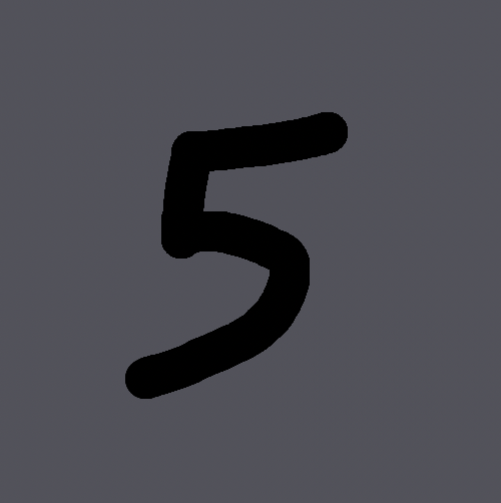
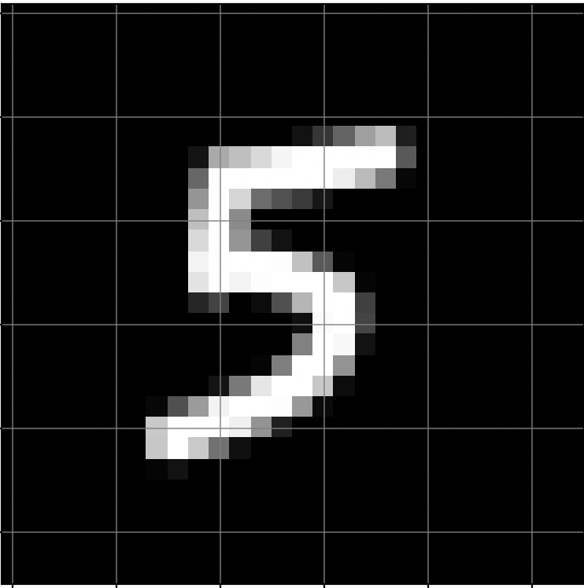

# NumberGuesser
Application which uses a neural network trained on the MNIST dataset to determine the value of hand drawn digits. The model that is making the predictions can be found [here](https://github.com/anshvijay28/NeuralNetwork). 

This front end is making the predictions by simply executing a forward pass of the model every time a user hits submit. After training the model I simply imported the weights and bias matrices as json files. The model will output a probability vector of length 10, and output its maximum as the predictions. The vector is printed to the console on submit so you can see it there. See [forwardPass.js](https://github.com/anshvijay28/number-guesser/blob/main/src/scripts/forwardPass.js) to see how the model is predicting the digit. 

In addition to importing weights and biases, I had to use [average-pooling](https://paperswithcode.com/method/average-pooling) in order to input the user's number into the model. Average-pooling is essentially an algorithm to convert an $N \times N$ image to an $M \times M$ image where $M < N$. Average-pooling had to be used in this case because the HTML canvas element (what the user is drawing on) will return a $504 \times 504$ array representing the users image, and the model only accepts $28 \times 28$ images. 

> Note: The canvas element actually returns an array representing a matrix with height and width equal to $504 \times 4 = 2016$ because it returns the rgba (red, green, blue, alpha) value of each pixel. So to obtain the matrix of relevant information you'd need to take every 4th element (every alpha value).
```
const ctx = canvas.getContext("2d");
const imageData = ctx.getImageData(0, 0, canvas.width, canvas.height);
const pixels = Array.from(imageData.data).filter((_, i) => (i + 1) % 4 === 0);
```
After obtaining the matrix I applied the average-pooling operation where I took the average of every $36 \times 36$ block and used it as an element in the resulting $28 \times 28$ matrix. 

```
for (let i = 0; i < targetSize; i++) {
    for (let j = 0; j < targetSize; j++) {
        let sum = 0;
        for (let k = 0; k < blockSize; k++) {
            for (let l = 0; l < blockSize; l++) {
                let row = i * blockSize + k;
                let col = j * blockSize + l;
                sum += originalMatrix[row][col];
            }
        }
        let avg = sum / (blockSize * blockSize);
        new_image.push(avg)
    }
}
```
Here is an example of what the user draws and what the model sees after applying the average-pooling operation. 


<p align="center">
    
    
</p>


Checkout the project [here](https://number-guesser-efbea.web.app/)!